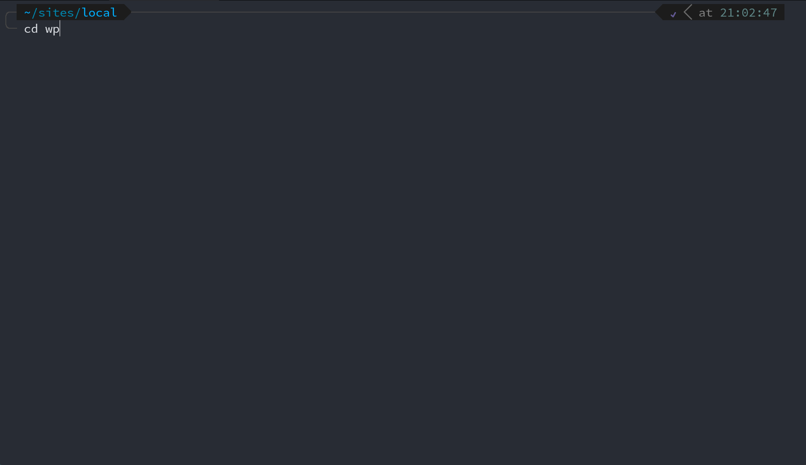
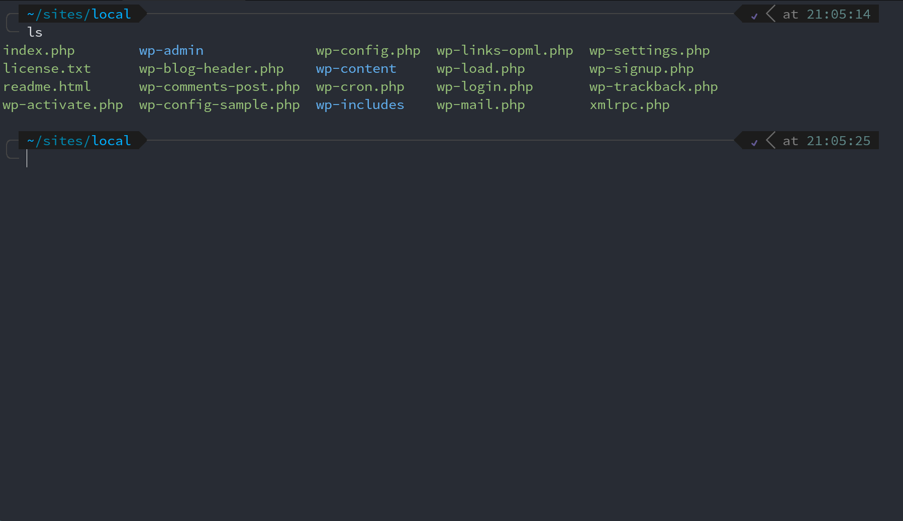
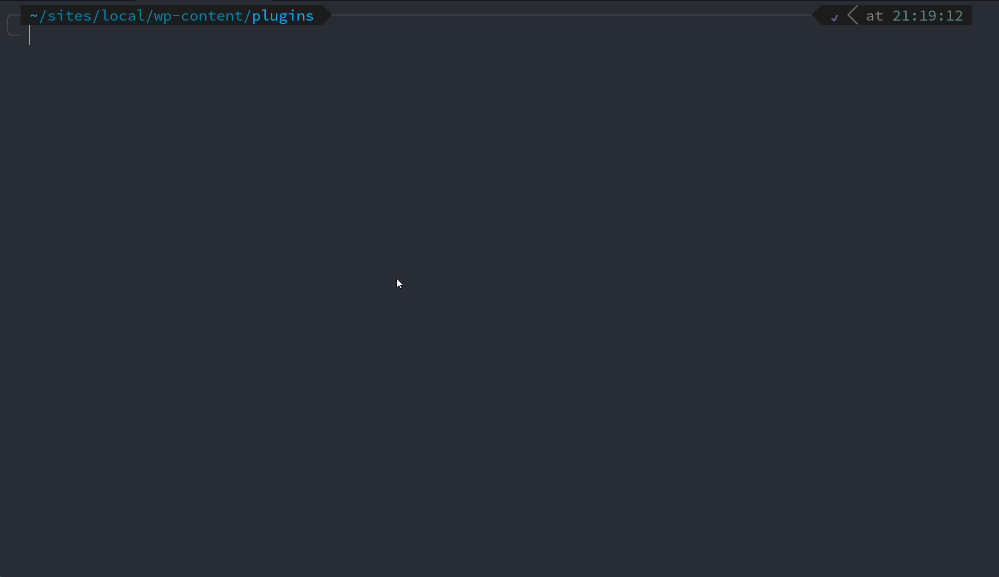
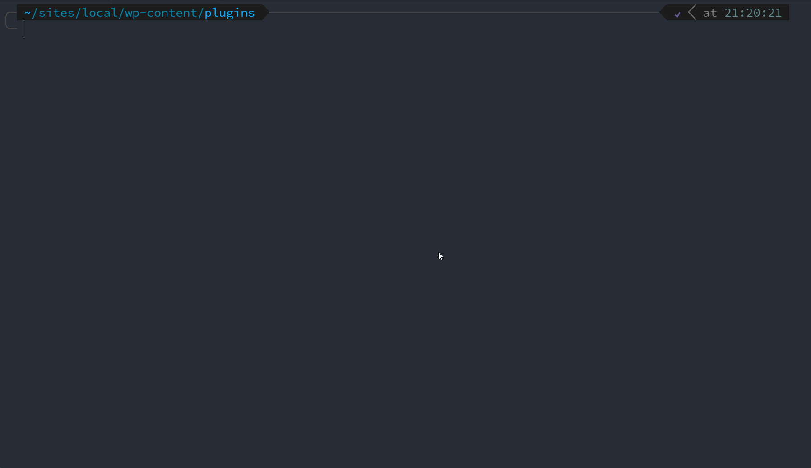
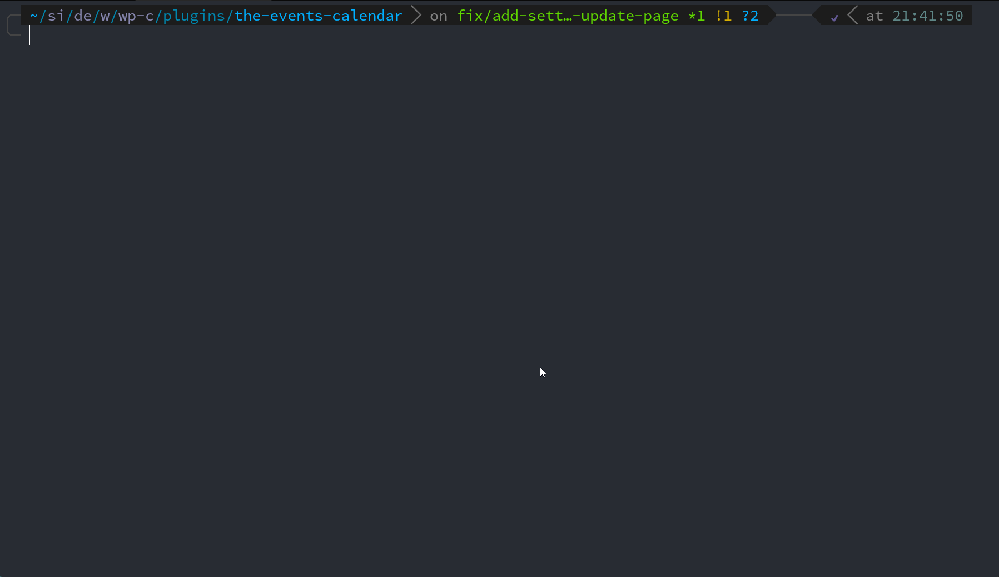

# slic

The slic (**S**tellarWP **L**ocal **I**nteractive **C**ontainers) CLI command provides a containerized and consistent environment for running automated tests.

## Table of Contents

* [Getting started](#getting-started)
    * [Why use `slic`?](#why-use-slic)
    * [Why use Codeception?](#why-use-codeception)
    * [Requirements](#requirements)
    * [Installation](#installation)
    * [The most important command to know](#the-most-important-command-to-know)
* [Using `slic`](#using-slic)
    * [Tell `slic` how to find your project](#tell-slic-how-to-find-your-project)
    * [Preparing your project](#preparing-your-project)
    * [Working with Multiple Stacks](#working-with-multiple-stacks)
    * [Git Worktree Support](#git-worktree-support)
    * [Adding tests](#adding-tests)
    * [Running tests](#running-tests)
* [Advanced topics](#advanced-topics)
    * [Defaults for your project with `slic.json`](/docs/slicjson.md)
    * [Managing PHP Versions](#managing-php-versions)
    * [Making composer installs faster](#making-composer-installs-faster)
    * [Changing your composer version](#changing-your-composer-version)
    * [Customizing `slic`'s `.env` file](#customizing-slics-env-file)
    * [Xdebug and `slic`](#xdebug-and-slic)
    * [Configuring IDEs for Xdebug](/docs/xdebug.md)
    * [Releasing a new version of `slic`](/CONTRIBUTING.md)
* [Update guide](#update-guide)
  * [From 2.0 to 3.0](#from-20-to-30)
  * [From 1.0 to 2.0](#from-10-to-20)


## Getting started

### Why use `slic`?

One of the biggest stumbling blocks that engineers face when getting automated testing going for their projects is the complexity of setting up a testing environment. And as your team size grows, the struggles with consistent test running increase.

**`slic` automatically configures a Codeception testing environment so you don't have to.**

Plus, it provides a lot of handy development tools and utilities that you can use while developing your project _or_ during Continuous Integration builds!

### Why use Codeception?

[Codeception](https://codeception.com/) is a PHP testing framework that uses [PHPUnit](https://phpunit.de/) under the hood, adding all sorts of extra features to make testing PHP much easier. By using Codeception, you then get the ability to use [wp-browser](https://wpbrowser.wptestkit.dev/), a module that _greatly_ simplifies testing WordPress plugins, themes, and whole WP sites at all levels of testing.

» Learn more about [wp-browser here](https://wpbrowser.wptestkit.dev/) and get it set up on your project.

> You can see examples of what to toss in your `composer.json` in our [stellarwp/schema](https://github.com/stellarwp/schema/blob/main/composer.json) repository.

### Requirements

Docker.

That's the only prerequisite. Get that installed and running on your machine and you'll be good to go!

### Installation

#### 1. Clone the repo

> These instructions are assuming that you are cloning the `slic` repository in `~/projects`. If you want it in a different location, feel free to tweak the example commands below.

```bash
cd ~/projects
git clone git@github.com:stellarwp/slic.git
```

#### 2. Add `slic` to your `$PATH`

_Assuming you are cloning the `slic` repository in `~/projects`:_

```bash
echo "export PATH=$HOME/projects/slic:$PATH" >> ~/.bashrc
source ~/.bashrc
```

> If you are using zsh, change `~/.bashrc` to `~/.zshrc`.

### The most important command to know

`slic` is well documented within the CLI utility itself. To see all of the available commands, run:

```bash
slic help
```

You can see details and usage on each command by running:

```bash
slic help <command>
```

> **Working with Multiple Stacks:** Most `slic` commands support a global `--stack=<path>` flag to target a specific stack. See [Working with Multiple Stacks](#working-with-multiple-stacks) for details.

## Using `slic`

The `slic` command has many subcommands. You can discover what those are by typing `slic` or `slic help`. If you want
more details on any of the subcommands, simply type: `slic [subcommand] help`.

### Tell `slic` how to find your project

The `slic` command needs a place to look for plugins, themes, and WordPress. By default, `slic` creates a `_plugins` and `_wordpress` directory within the local checkout of `slic`. In most cases, however, developers like to run automated tests against the paths where they are actively working on code – which likely lives elsewhere.

Good news! You can use the `slic here` sub-command to create a **stack** that points to the directories you want to work with.

**What's a stack?** A stack is an isolated slic environment with its own containers, configuration, and ports. You can have multiple stacks running simultaneously, allowing you to work on different projects or WordPress installations without conflicts.

There are two locations you can tell `slic` to look.

#### 1. Plugins Directory

If you want to defer all of the WP site configuration to a dynamically pulled codebase and _just_ worry about testing
plugins, you can run the `slic here` command right from the parent directory of your project. Doing so will restrict `slic` to running tests on subdirectories of where you ran the command.

Example:

```bash
# Change to your plugin containing dir (likely some path to wp-content/plugins)
cd /path/to/your/wp-content/plugins

slic here
```

This creates a new stack for this directory. If you already have a stack for this directory, it updates the configuration.



#### 2. WordPress Directory

The second option is to navigate to the root of your site (likely where `wp-config.php` lives) and run the `slic here`
command.

> Note: This is an opinionated option and there are some assumptions that are made:
>
> 1. That the WordPress directory _is_ the path you are indicating or in a sub-directory called `wp/`.
> 2. That the `wp-content/` (or `content/`) directory is a sub-directory of the location in which you are typing `slic here`.


```bash
# Change to your root directory of your site (where your wp-config.php file lives)
cd /path/to/your/site

slic here
```

By running `slic here` at the site level, this allows you to set plugins, themes, or the site itself as the location
from which to run tests. This also has the benefit of running tests within the WP version that your site uses.



#### Stack Isolation and Ports

Each stack runs in complete isolation with its own:
- Docker containers (separate from other stacks)
- MySQL database instance
- Redis cache
- WordPress container

**Important Note:** While each stack has its own WordPress *container*, the WordPress codebase itself may be shared among containers. If you're using the default `_wordpress` directory inside slic (when running `slic here` from a plugins directory), all stacks will share the same WordPress installation files. However, each stack maintains its own database and Redis cache, so data remains isolated.

**Ports are automatically assigned by Docker** when containers start. You don't need to configure or worry about port conflicts – Docker handles this for you. You can view the assigned ports for any stack using:

```bash
slic using        # Show current stack and its ports
slic stack list   # Show all stacks and their ports
slic stack info   # Show detailed info for current stack
```

### Preparing your project

### Point `slic` at your project

Before you can do anything productive with `slic`, you need to tell it which
project you wish to use and then you can initialize the project, run tests, and
execute other commands to your heart's content!

Assuming you have a plugin called `the-events-calendar` in the plugins directory
where you ran `slic here`, you can tell `slic` you want to take actions on that
plugin using the following command:

```bash
slic use the-events-calendar
```

> For more information on this command, run `slic help use`.



### Initialize your project

With your desired plugin containing directory set, you will need to initialize plugins so that they are prepped and ready
for `slic`-based automated test running. You do that using `slic init [plugin]`.

Example:

```bash
slic init event-tickets
```



What this command does:

1. Generates a `.env.testing.slic` env file in the plugin.
2. Generates a `test-config.slic.php` file in the plugin.
3. Generates a `codeception.slic.yml` file in the plugin.
4. Prompts for confirmation on running `composer` and `npm` installs on the plugin.

### Working with Multiple Stacks

`slic` supports running multiple isolated stacks simultaneously. This is useful when you're working on multiple projects, need different WordPress versions, or want to test against different configurations.

#### How Stack Resolution Works

When you run a `slic` command, it determines which stack to use in this priority order:

1. **`--stack=<path>` flag** - Explicitly specify the stack to use
2. **`SLIC_STACK` environment variable** - Set programmatically for CI or scripts
3. **Current working directory** - Automatically uses the stack that matches your current directory
4. **Single stack fallback** - If only one stack exists, uses it automatically

#### Managing Multiple Stacks

##### Viewing All Stacks

To see all your registered stacks with their configuration and ports:

```bash
slic stack list
```

This shows:
- Stack directory path
- Current target (which plugin/project is active)
- WordPress URL and assigned port
- MySQL and Redis ports
- Container status

##### Viewing Current Stack Information

To see detailed information about the stack you're currently using:

```bash
slic using
```

This displays:
- Current target plugin/project
- Stack directory
- WordPress URL and all port assignments
- Whether your current directory matches the active target

For even more details:

```bash
slic stack info
```

##### Stopping a Specific Stack

To stop containers for a specific stack without affecting others:

```bash
slic stack stop /path/to/your/plugins
```

If you have multiple stacks and don't specify which one, `slic` will show you a list to choose from.

##### Stopping All Stacks

To stop all registered stacks at once:

```bash
slic stack stop all
```

This command:
- Shows a list of all stacks that will be stopped
- Prompts for confirmation before proceeding
- Stops each stack even if one fails
- Shows a comprehensive summary with success/failure counts
- Works from any directory

**Options:**
- `-y, --yes` - Skip confirmation prompt and proceed immediately

**Examples:**
```bash
slic stack stop all         # Interactive - prompts for confirmation
slic stack stop all -y      # Non-interactive - stops all stacks immediately
slic stack stop all --yes   # Same as -y
```

**Caution:** Use `-y` carefully in automation scripts. It bypasses all confirmations and will immediately stop and remove all registered stacks.

**Note:** This command requires interactive input to confirm the action unless the `-y` flag is provided. It will exit with an error when run in non-interactive environments (such as CI pipelines or automation scripts) without the `-y` flag.

This is useful when you want to free up system resources or restart your Docker environment cleanly.

##### Targeting a Specific Stack

When working with multiple stacks, you can target a specific one in two ways:

**Option 1: Change to the stack directory**

```bash
cd /path/to/project-a/wp-content/plugins
slic run wpunit  # Runs tests in project-a's stack
```

**Option 2: Use the `--stack` flag**

```bash
slic --stack=/path/to/project-a/wp-content/plugins run wpunit
```

The `--stack` flag works with any `slic` command:

```bash
# Use a different stack
slic --stack=/path/to/project-b/wp-content/plugins use my-plugin

# Run composer in a specific stack
slic --stack=/path/to/project-a/wp-content/plugins composer install

# View logs from a specific stack
slic --stack=/path/to/project-b/wp-content/plugins logs
```

#### Port Management

Unlike earlier versions of `slic`, you **no longer need to configure ports**. Docker automatically assigns available ports when containers start, preventing conflicts when running multiple stacks.

To find your stack's ports:

```bash
# Quick view
slic using

# Detailed view
slic stack info

# All stacks
slic stack list
```

The WordPress site will be accessible at `http://localhost:<auto-assigned-port>` where the port is shown by these commands.

#### Example Multi-Stack Workflow

Here's a typical workflow when working on multiple projects:

```bash
# Create stack for project A
cd ~/projects/client-a/wp-content/plugins
slic here
slic use their-plugin

# Create stack for project B
cd ~/projects/client-b/wp-content/plugins
slic here
slic use another-plugin

# Work on project A from anywhere
slic --stack=~/projects/client-a/wp-content/plugins run wpunit

# Or cd to project A and work normally
cd ~/projects/client-a/wp-content/plugins/their-plugin
slic run wpunit  # Automatically uses project A's stack

# Switch to project B
cd ~/projects/client-b/wp-content/plugins/another-plugin
slic shell  # Opens shell in project B's stack

# View all your stacks
slic stack list
```

#### XDebug Configuration

Each stack gets its own unique XDebug configuration to enable debugging multiple stacks simultaneously without conflicts. This is achieved through stack-specific XDebug ports and server names.

**How Stack-Specific XDebug Works:**

When you create a stack with `slic here`, slic automatically generates:
- A unique XDebug port in the range 49000-59000
- A unique server name in the format `slic_{hash}`

Both are deterministically generated from your stack path using an MD5 hash, so they remain consistent across restarts.

**Viewing Your Stack's XDebug Configuration:**

To see your stack's XDebug settings, run:

```bash
slic xdebug status
```

This displays:
- XDebug status (on/off)
- Remote host and port
- IDE key (server name)
- Path mappings for your IDE

**Why This Matters:**

With stack-specific XDebug configuration, you can:
- Debug tests running in multiple stacks at the same time
- Keep separate IDE debug configurations for each project
- Avoid port conflicts when multiple stacks are active

**Example:**

If you create stacks for two different projects:

```bash
# Stack A at ~/projects/client-a/wp-content/plugins
cd ~/projects/client-a/wp-content/plugins
slic here
slic xdebug status
# Shows: IDE Key: slic_a7f3c891, Remote port: 52341

# Stack B at ~/projects/client-b/wp-content/plugins
cd ~/projects/client-b/wp-content/plugins
slic here
slic xdebug status
# Shows: IDE Key: slic_b8d4e902, Remote port: 54782
```

Each stack has different port numbers and server names based on their paths. This means you can run tests with debugging enabled in both stacks simultaneously, as long as your IDE has separate debug configurations for each (using their respective ports and server names).

For detailed instructions on configuring your IDE for XDebug, see [Configuring IDEs for Xdebug](/docs/xdebug.md).

#### Legacy Single-Stack Migration

If you were using `slic` before multi-stack support was added, your existing configuration is automatically migrated the first time you run a `slic` command. Your original `.env.slic.run` file is backed up as `.env.slic.run.backup` and a new stack is registered for your configuration.

The migration is seamless – you can continue using `slic` exactly as before, and when you're ready, you can create additional stacks for other projects.

### Git Worktree Support

`slic` supports git worktrees for concurrent development workflows. Each worktree automatically gets its own isolated Docker Compose stack with unique XDebug ports, allowing you to work on multiple branches of the same plugin simultaneously without switching context.

#### Use Cases

Git worktree support is ideal for:

- **Parallel feature development** - Work on multiple features in the same plugin at once
- **Pull request reviews** - Test and review PRs without losing your current work
- **Bug fixes while developing** - Quickly switch to a hotfix without disrupting your feature branch
- **Cross-branch testing** - Compare behavior across different branches side-by-side
- **Concurrent client work** - Handle urgent fixes while keeping long-running features in progress

#### How It Works

When you create a worktree with `slic`, it:

1. Creates a new git worktree in a parallel directory (following git's standard naming convention)
2. Automatically registers a new slic stack for that worktree
3. Assigns a unique XDebug port (in the 49000-59000 range)
4. Links the worktree stack to the base stack (shown hierarchically in `slic stack list`)
5. Maintains complete stack isolation while sharing the WordPress installation and database

**Important:** Each worktree stack shares the same WordPress codebase and database as the base stack, but runs in its own isolated Docker containers with its own ports.

#### Creating a Worktree

To create a new worktree for your current plugin:

```bash
cd /path/to/plugins/the-events-calendar
slic worktree add feature/my-new-feature
```

This creates:
- A new git worktree at `../the-events-calendar-feature-my-new-feature/`
- A dedicated slic stack with format `base-stack@worktree-dir`
- A unique XDebug port for isolated debugging

**Options:**

```bash
# Create from a specific branch
slic worktree add feature/new-feature origin/main

# Create and track a new branch
slic worktree add -b feature/new-feature
```

The worktree directory name follows git's convention: the plugin name followed by the branch name with slashes replaced by hyphens.

#### Listing Worktrees

To see all worktrees for your current plugin:

```bash
slic worktree list
```

This displays a table showing:
- Branch name
- Full path to the worktree
- Associated slic stack name
- XDebug port assignment
- Whether the stack is currently active

#### Switching Between Worktrees

Simply navigate to the worktree directory:

```bash
cd ../the-events-calendar-feature-my-new-feature
slic run wpunit  # Automatically uses the worktree's stack
```

Or use the `--stack` flag from anywhere:

```bash
slic --stack=/path/to/worktree run wpunit
```

#### Removing a Worktree

To remove a worktree and clean up its slic stack:

```bash
slic worktree remove feature/my-new-feature
```

You can specify the worktree by:
- Branch name: `slic worktree remove feature/my-new-feature`
- Directory name: `slic worktree remove ../the-events-calendar-feature-my-new-feature`
- Absolute path: `slic worktree remove /full/path/to/worktree`

This command:
1. Removes the git worktree
2. Unregisters the associated slic stack
3. Cleans up Docker resources

**Note:** The command will fail if:
- The worktree has uncommitted changes (use `git worktree remove --force` separately if needed)
- The worktree is currently locked
- The worktree directory is in use

#### Syncing Worktrees

Over time, worktrees and stacks can become out of sync (e.g., if a worktree is manually deleted or a stack is removed). To detect and clean up orphaned resources:

```bash
slic worktree sync
```

This command:
- Detects orphaned worktree stacks (slic stack exists but git worktree doesn't)
- Detects unregistered worktrees (git worktree exists but slic stack doesn't)
- Prompts you to clean up orphaned stacks
- Offers to register unregistered worktrees

Run this periodically or whenever you suspect your worktrees and stacks are out of sync.

#### Stack Isolation and XDebug

Each worktree stack:
- Has its own Docker Compose project name (e.g., `slic_plugins_tec_feature_my_feature`)
- Gets a unique XDebug port (automatically allocated from 49000-59000)
- Runs in complete isolation with separate containers
- Shares the same WordPress installation and database with the base stack
- Can run simultaneously with the base stack and other worktree stacks

**Example XDebug configuration:**

```bash
# In base stack
cd /path/to/plugins/the-events-calendar
slic xdebug status
# Shows: IDE Key: slic_a7f3c891, Remote port: 52341

# In worktree
cd ../the-events-calendar-feature-new-feature
slic xdebug status
# Shows: IDE Key: slic_b8d4e902, Remote port: 54782
```

Each worktree can be debugged independently without port conflicts.

#### Automatic Worktree Detection

If you navigate to a worktree directory that hasn't been registered with `slic`, the CLI will automatically detect it and offer to register it:

```bash
cd ../the-events-calendar-feature-some-feature
slic use the-events-calendar
# Detects unregistered worktree and prompts: "Register this worktree? (y/n)"
```

This is useful when:
- Cloning a repository with existing worktrees
- Switching to a new machine
- Working with worktrees created by team members

#### Hierarchical Stack View

To see your base stack and all associated worktree stacks in a tree structure:

```bash
slic stack list
```

Example output:

```
┌─ /path/to/plugins
│  └─ Target: the-events-calendar
│     WordPress: http://localhost:52341
│
│  ┌─ Worktrees:
│  │  ├─ /path/to/plugins-feature-new-widget (feature/new-widget)
│  │  │  └─ XDebug: 54782
│  │  └─ /path/to/plugins-bugfix-123 (bugfix/123)
│  │     └─ XDebug: 55891
```

This view makes it easy to:
- See which worktrees exist for each base stack
- Identify XDebug ports for each worktree
- Understand the relationship between stacks

#### Example Workflow

Here's a typical workflow using worktrees:

```bash
# Start with your main development branch
cd ~/projects/wp-content/plugins/the-events-calendar
slic use the-events-calendar

# Create a worktree for a new feature
slic worktree add feature/new-widget
cd ../the-events-calendar-feature-new-widget

# Work on the feature
slic run wpunit
slic shell

# Meanwhile, an urgent bug comes in
cd ~/projects/wp-content/plugins/the-events-calendar
slic worktree add bugfix/urgent-fix
cd ../the-events-calendar-bugfix-urgent-fix

# Fix the bug and test
slic run wpunit

# Both stacks are running simultaneously
slic stack list  # See both worktrees

# When done, clean up
cd ~/projects/wp-content/plugins/the-events-calendar
slic worktree remove feature/new-widget
slic worktree remove bugfix/urgent-fix
```

#### Best Practices

**Do:**
- Use `slic worktree list` to see what worktrees you have before creating new ones
- Run `slic worktree sync` periodically to keep things clean
- Use descriptive branch names that clearly identify the purpose
- Remove worktrees when you're done with them to save disk space

**Don't:**
- Manually delete worktree directories (use `slic worktree remove` instead)
- Create too many worktrees simultaneously (each consumes system resources)
- Forget to commit or push work before removing a worktree

#### Troubleshooting

**Problem:** `slic worktree add` fails with "worktree already exists"
**Solution:** Check `git worktree list` and either use the existing worktree or remove it first with `slic worktree remove`

**Problem:** Stack appears in `slic stack list` but worktree doesn't exist
**Solution:** Run `slic worktree sync` to clean up orphaned stacks

**Problem:** Worktree exists but stack isn't registered
**Solution:** Navigate to the worktree directory and run any `slic` command, which will prompt to register it, or run `slic worktree sync`

**Problem:** XDebug not working in worktree
**Solution:** Check `slic xdebug status` in the worktree directory to see the unique port, then configure your IDE with that port

### Adding tests

As mentioned above, you'll need to use Codeception for your automated testing and it is _highly_ recommended that you make use of [wp-browser](https://wpbrowser.wptestkit.dev/) - which adds a _lot_ of WordPress helper functions and utilities.

### Running tests

Ok. You have `slic` set up. It is pointing at your project. Your project has tests. Now you want to run one of your test suites. Let's pretend that your test suite is called `wpunit`.

You can run the full suite like so:

```bash
slic run wpunit
```

Or, if you want an even more efficient way to do it, you can do:

```bash
slic shell

# You'll get a prompt once you are thrown into the shell

> cr wpunit
```

## Advanced topics

### Managing PHP Versions

By default, slic uses PHP 7.4, but you can easily switch between different PHP versions for your projects.

#### Checking the Current PHP Version

To see which PHP version slic is configured to use or if a version is staged:

```bash
slic php-version
```

#### Setting a PHP Version

If you're working with a project and want to test it with a different PHP version, you can manually set the version:

```bash
slic php-version set 8.1
```

This will set the PHP version to 8.1 and prompt you to rebuild the stack. This is useful when you want to test your project against a different PHP version than what's automatically detected.

For CI environments or when you want to pre-configure the PHP version before running `slic use`:

```bash
slic php-version set 8.4 --skip-rebuild
```

This stages the PHP version change for the next time you run `slic use <project>`, allowing you to avoid pulling Docker images multiple times.

#### Automatic PHP Version Detection

When you run `slic use <project>`, slic will automatically detect and use the PHP version specified in:

1. The project's `slic.json` file (using the `phpVersion` property)
2. The project's `composer.json` file (using the `config.platform.php` property)

#### PHP Version Priority

PHP versions are applied in the following priority order:

1. Command line override: `SLIC_PHP_VERSION=8.3 slic use <project>`
2. Staged version (from `slic php-version set <version> --skip-rebuild`)
3. A Project's `.env.slic.local` file
4. Auto-detected version from project configuration

#### Resetting to Default

To reset slic to the default PHP version (7.4):

```bash
slic php-version reset
```

### Making composer installs faster

By default, `slic` caches composer dependencies within the container
and, when the containers are destroyed, so is the cache. The good news
is that `slic` allows you to map your machine's composer cache directory into
the `slic` containers so that repeated `slic composer` commands can benefit from
the cache as well!

```bash
# Feel free to change the path to whatever is appropriate for your machine.
slic composer-cache set $HOME/.cache/composer
```

For more information on this topic, type `slic help composer-cache`.



### Changing your composer version

By default, `slic` uses composer v1 but you may also choose to use v2 by running the following command:

`slic composer set-version 2`

If you need to go back, just set the version back to 1:

`slic composer set-version 1`

If you want to know which version `slic` is pointed at, you can always call:

`slic composer get-version`

### Installing private packages with composer

If you need to install a private composer package, configure the [COMPOSER_AUTH](https://getcomposer.org/doc/03-cli.md#composer-auth) environment variable. For example, to install a package from a private GitHub repository:

> Note: You may need to create a [Personal Access Token](https://docs.github.com/en/authentication/keeping-your-account-and-data-secure/creating-a-personal-access-token).

```shell
export COMPOSER_AUTH='{"github-oauth": {"github.com": "YOUR_TOKEN_HERE"}}'
```

Then, restart slic and try again:

```shell
slic restart; slic composer update
```

Or, in a GitHub Action, for example:

```yaml
jobs:
  test:
    runs-on: ubuntu-latest

    env:
      COMPOSER_AUTH: '{"github-oauth": {"github.com": "${{ secrets.GH_BOT_TOKEN }}"}}'
```

### Customizing `slic`'s `.env` file

The `slic` CLI command leverages `.env.*` files to dictate its inner workings. It loads `.env.*` files in the following order, the later files overriding the earlier ones:

1. [`.env.slic`](/.env.slic) - this is the default `.env` file and **should not be edited**.
2. `.env.slic.local` in the main _slic_ directory - this file doesn't exist by default. Make overrides to all your projects (e.g. `SLIC_GIT_HANDLE`) by creating it and adding lines to your heart's content.
3. `.env.slic.local` in your _target's_ directory - this file doesn't exist by default. Make overrides to a single project (e.g. `SLIC_PHP_VERSION`).
4. `.env.slic.run` - this file is generated by `slic` and includes settings that are set by specific `slic` commands.

### Xdebug and `slic`

#### Available Commands

##### `slic xdebug help`

List the available Xdebug commands.

##### `slic xdebug status`

See if Xdebug is enabled or disabled, the host information, and the path mapping to add to your IDE.

When working with multiple stacks, this command displays stack-specific XDebug configuration:
- The unique XDebug remote port for the current stack (range 49000-59000)
- The stack-specific IDE key/server name (format: `slic_<hash>`)
- Path mappings for your IDE

Each stack gets its own XDebug configuration, allowing you to debug tests running in multiple stacks simultaneously without port conflicts.

Note that this command cannot be ran within `slic shell` because you've SSH'd into the Codeception container which has no knowledge of *slic*.

See also: [Configuring Xdebug](/docs/xdebug.md)


#### Enable/Disable Xdebug

Xdebug can be toggled in both the `wordpress` and `slic` containers:

**Global commands** (requires container restart):
- `slic xdebug on` - Enable Xdebug in both containers
- `slic xdebug off` - Disable Xdebug in both containers

When using these commands, `slic` will prompt you to restart the containers.

**Within `slic shell`** (takes effect immediately, no restart needed):
- `xon` - Enable Xdebug
- `xoff` - Disable Xdebug

## Update Guide

This guide covers the steps needed when upgrading `slic` between major versions.

### From 2.0 to 3.0

> **New Feature:**
> - Multi-stack support allows running multiple isolated slic environments simultaneously
> - Automatic port assignment eliminates port configuration and conflicts

#### Automatic Migration

If you're upgrading from a single-stack setup, `slic` will automatically migrate your configuration:

1. Your existing `.env.slic.run` is backed up to `.env.slic.run.backup`
2. A new stack is registered for your current configuration
3. Default ports (8888 for WordPress, 9006 for MySQL, 8379 for Redis) are preserved in the migrated stack
4. You can continue working exactly as before

**No action required** – the migration happens automatically on your next `slic` command.

#### Taking Advantage of Multi-Stack Features

After migration, you can:

1. **Create additional stacks** for other projects:
   ```bash
   cd /path/to/another/project/wp-content/plugins
   slic here
   ```

2. **View all your stacks**:
   ```bash
   slic stack list
   ```

3. **Check current ports** (now auto-assigned by Docker):
   ```bash
   slic using
   ```

4. **Target specific stacks** when needed:
   ```bash
   slic --stack=/path/to/project run wpunit
   ```

See [Working with Multiple Stacks](#working-with-multiple-stacks) for complete documentation.

### From 1.0 to 2.0

> **Breaking Change:**
> - MySQL 5.5.62 is now used with PHP 7.4 to match WordPress minimum requirements

#### MySQL 5.5 Database Changes

* You can opt out of this by setting the `SLIC_DB_NO_MIN` env var to a non-falsy value
* You can specify the database image to use with the `SLIC_DB_IMAGE` env var
* Database dump collations might need to be updated in test files

**What you need to update:**

If your tests use database dumps, they might need updating to be compatible with MySQL `5.5.62`.  
The change needed is updating the collation of database tables from `utf8mb4_unicode_520_ci` to `utf8mb4_unicode_ci`.

**Option 1:** Use this command:

```bash
find ./tests -type f -name "*.sql" | xargs -I{} sed -i.bak 's/utf8mb4_unicode_520_ci/utf8mb4_unicode_ci/g' {} && find ./tests -name "*.sql.bak" -delete
```

**Option 2:** Use your IDE's search-and-replace functionality to replace, in the database dump files, occurrences of `utf8mb4_unicode_520_ci` with `utf8mb4_unicode_ci`.

**Verifying the changes:**
After updating your SQL files, run a sample test to ensure the database loads correctly.
Look for any SQL errors related to collations in your test output.

## Acknowledgements

Props to [@lucatume](https://github.com/lucatume), [@borkweb](https://github.com/borkweb), and [The Events Calendar](https://theeventscalendar.com) team for creating this tool and it's predecessor, `tric`.
