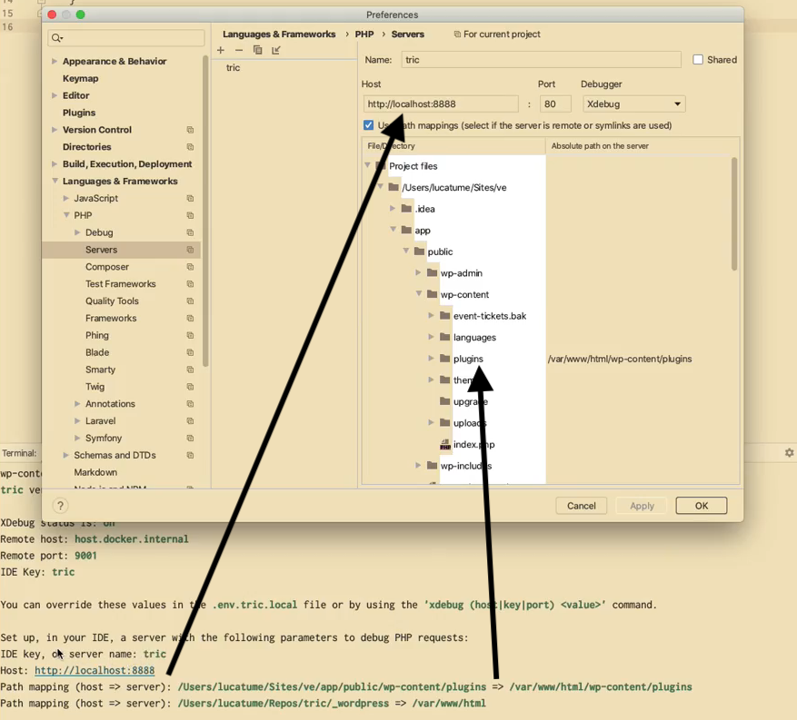

# Xdebug in `slic`

## Available Commands

### `slic xdebug help`

List the available Xdebug commands.

### `slic xdebug status`

See if Xdebug is enabled or disabled, the host information, and the path mapping to add to your IDE.

Note that this command cannot be ran within `slic shell` because you've SSH'd into the Codeception container which has no knowledge of *slic*.

#### Setup IDE for Xdebug

##### PhpStorm

Set your localhost plugin folder to map to `/var/www/html/wp-content/plugins`.

Video walk-throughs for [PhpStorm](https://drive.google.com/file/d/1sD8djXgmYWCUDCm_1XZNRx_GBbotmmiB/view?usp=sharing) and [VSCode](https://drive.google.com/file/d/1519M2SRVgWVgTm0Px6UKfBjoQgxCR7Cp/view?usp=sharing).

Screenshot from PhpStorm's video:

### Enable/Disable Xdebug

1. `slic xdebug on`
1. `slic xdebug off`
1. Within `slic shell`:
    1. `slic xon`
    1. `slic xoff`

